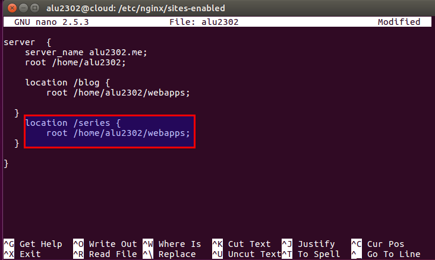
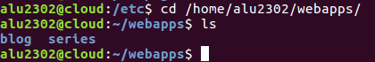
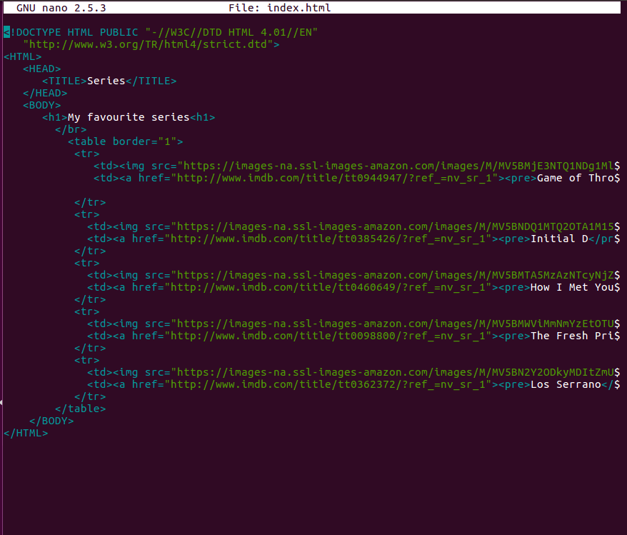
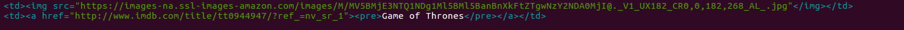
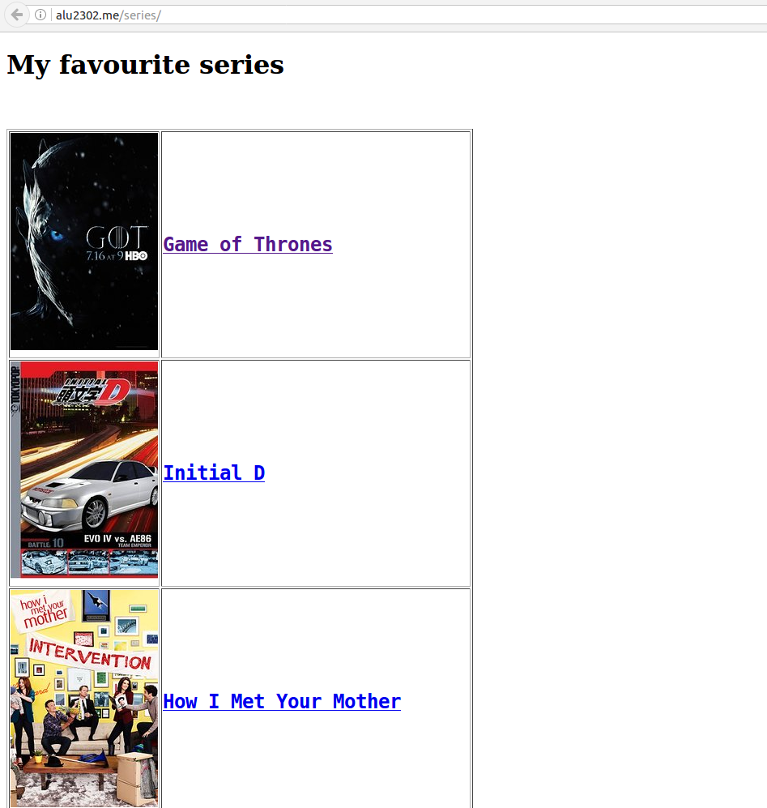

# UT1-A1: Mis series favoritas

## Propósito de la actividad

Crear una página web desde el dominio designado (alu2302.me), creando un apartado llamado "series", desde el cual se almacenen 5 series de televisión, aparte de un enlace a la sección de IMDb correspondiente a cada serie.

## Comienzo de la actividad

* Creamos el directorio series en /home/alu2302/webapps. Nos vamos al fichero /etc/nginx/sites-enabled, donde encontramos el fichero de configuración nuestro virtual host. A continuación escribimos la siguiente línea:

* Una vez tenemos el directorio creado y todo bien puesto en el fichero de configuración, dentro de /series creamos un fichero index.html, donde crearemos la pequeña página web antes mencionada.

* Personalmente opté por colocar dentro de una tabla la imagen de la serie en cuestión seguida de su nombre en inglés (salvo el caso de Los Serrano por cuestiones ovbias), el cual enlaza a la página de IMDb.

* Aquí tenemos el resultado de la pág web (http://alu2302.me/series)

