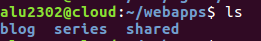
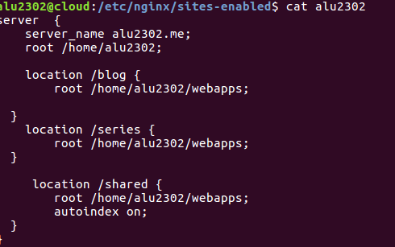
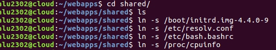
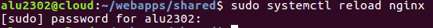
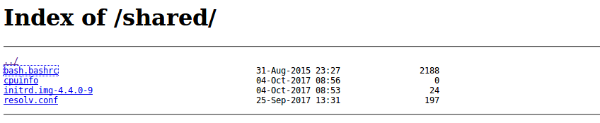

# UT1-A2: Listado de directorios

## Propósito de la actividad

La actividad consiste en permitir el acceso al contenido de un subdirectorio dentro de la ruta raíz de Nginx, enlazando una serie de ficheros desde ahí.

## Comienzo de la actividad

* Lo primero que hacemos es crear el directorio shared en la ruta /home/alu2302/webapps

* Luego, en el fichero de configuración de nuestro virtual host realizamos la directiva de nuestro nuevo directorio tal y como hemos hecho hasta ahora, sólo que activando la opción "autoindex on"

* Una vez dado este paso, nos vamos al directorio shared y dentro del mismo comenzamos a hacer enlaces simbólicos de ciertos ficheros.

* Reiniciamos el servicio.

* Resultado de nuestro "repositorio" en http://alu2302.me/shared

