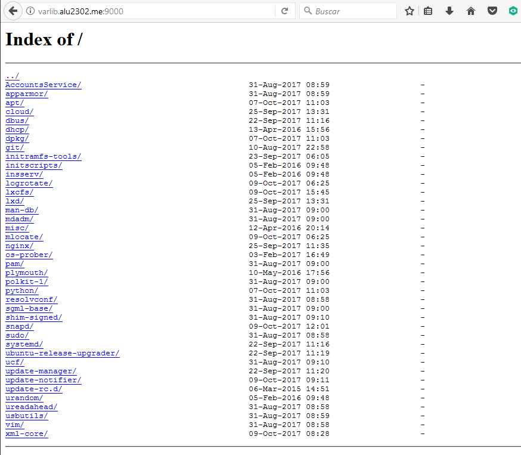

# UT1-A3: Trabajo con virtual hosts

## Propósito de la actividad
Crear y configurar cuatro sitios web utilizando como plataforma nuestro servidor Nginx.

## Comienzo de la actividad

### Sitio web 1

* La página web http://imw.alu2302.me debe mostrar una página con la imagen "Diagrama de unidades de trabajo" que se encuentra en el moodle de la propia asignatura. Aparte que la imagen debe ser descargada y enlazada desde el directorio local.

Creamos el fichero de configuración de nuestro virtual host "imw"

Colocamos la ruta en la cual figurará el directorio con el contenido que se mostrará en el navegador.

Hacemos el enlace del virtual host en el directorio "sites-enabled" (ESTE PROCESO SE REPETIRÁ CON CUALQUIER VIRTUAL HOST CREADO, POR LO QUE SE DARÁ POR HECHO DURANTE EL RESTO DEL INFORME)

Creamos el directorio "imw" en /home/alu2302

 Creamos el fichero index dentro del directorio anteriormente creado.

 

 Enlazamos la imagen, que está situada en el mismo directorio (descargada utilizando el comando "scp" desde la máquina real) y reiniciamos el servicio con el comando "sudo systectl reload nginx" (OTRO PROCESO REITERATIVO, PERO NECESARIO)

 Resultado final cuando accedemos a la web.

### Sitio web 1.1

* La página web http://imw.alu2302.me/mec debe mostrar una página con un enlace al Real decreto del título de Administración de Sistemas Informáticos en Red.

Utilizamos el virtual host antes creado y le añadimos la línea de configuración para el nuevo directorio.

Dentro del directorio "imw" creamos el directorio "mec", donde haremos otro index.

Ponemos la ruta al enlace designado.

Resultado de la página.

### Sitio web 2

* La página web http://varlib.alu2302.me:9000 debe mostrar el listado de ficheros y directorios de "/var/lib" de la máquina de producción.

Creamos el fichero "varlib", en el cuál estableceremos el enlace con el directorio que va a crearse en /home/alu2302, aparte de que lo configuraremos para que escuche por el puerto 9000 y que genere un indice. Por último enlazamos en /sites-enabled

Creamos el directorio en /home/alu2302

Creamos un enlace simbólico en el directorio anteriormente creado de /var/lib

Resultado final

### Sitio web 3

* La página web https://ssl.alu2302.me/students debe pedir usuario (usuario1) y clave (aula108), mostrar una página web con el nombre de todos los alumnos de la clase, aparte de prohibir el acceso al fichero .htpasswd

Generamos el fichero de configuración del virtual host de ssl.

En ese fichero apuntamos a la nueva ruta /students y en la misma directiva le ordenamos que se pida contraseña al entrar (auth_basic) y el fichero desde donde se guarda la misma (.htpasswd). Utilizando otra directiva, decimos que no se permita el acceso a .htpasswd

Utilizamos esta orden para generar una contraseña encriptada.

Con esta orden generamos el anteriormente mencionado fichero .htpasswd, en donde se almacena tanto nombre como contraseña.

Dentro del directorio ssl creamos students.

Creamos el fichero index.html

Contenido del mismo

Cuando tratamos de acceder nos pedirá usuario y contraseña.

### Sitio web 4

* Cualquiera de estas rutas:

 * http://redirect.alu2302.me/test/
 * http://www.redirect.alu2302.me/probando/
 * http://www.redirect.alu2302.me/hola/

Deben ser redireccionadas a http://redirect.alu2302.me, que a su vez debe mostrar el contenido de un fichero con extensión .zip (https://github.com/sdelquin/claseando/blob/master/imw/UT1/assignments/assignment3/initializr-verekia-4.0.zip). Aparte de todo esto, se deben generar dos ficheros .log donde se registren los accesos y los errores.

Creamos el fichero de virtual host.

Aquí mostramos las directivas creadas. Tenemos una que apunta al dominio redirect y otra que apunta al dominio www.redirect, e independientemente de cual sea la ruta final, todas irán a la web introducida en el parámetro "return". Aparte se han especificado las rutas de los ficheros .log

Una vez creados los directorios redirect y redirect/target, en esta última descomprimimos el contenido del .zip antes mencionado.

El resultado de cada intento de conexión a las direcciones anteriormente nombradas. 
