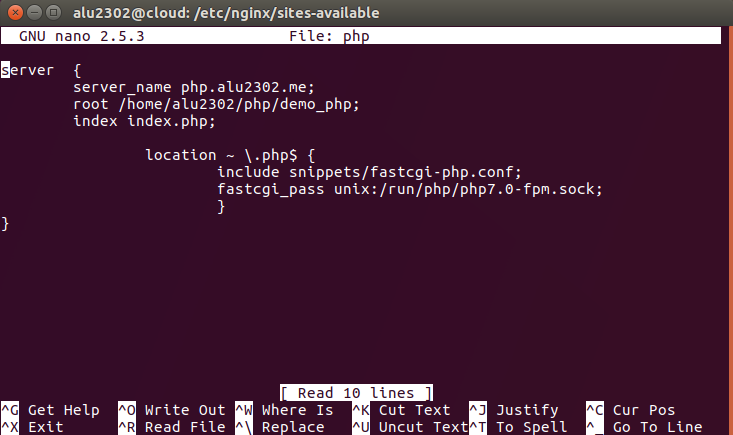
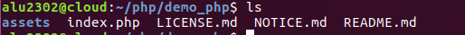
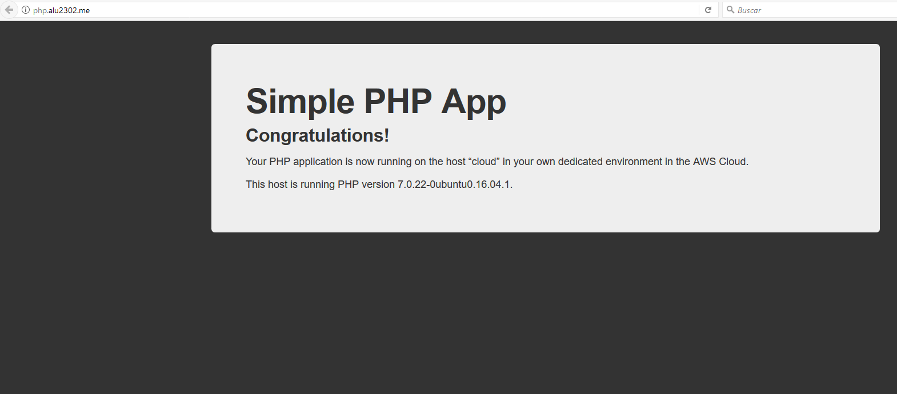
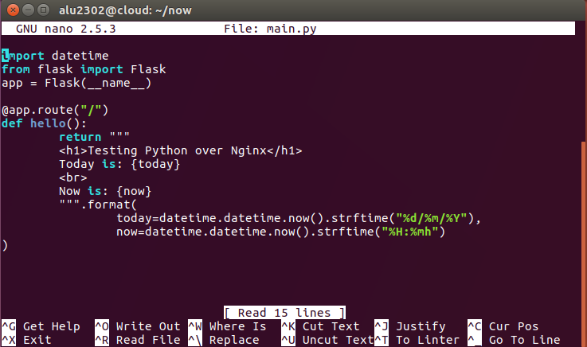
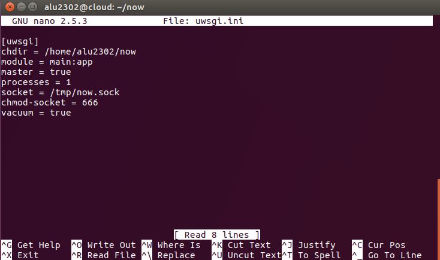
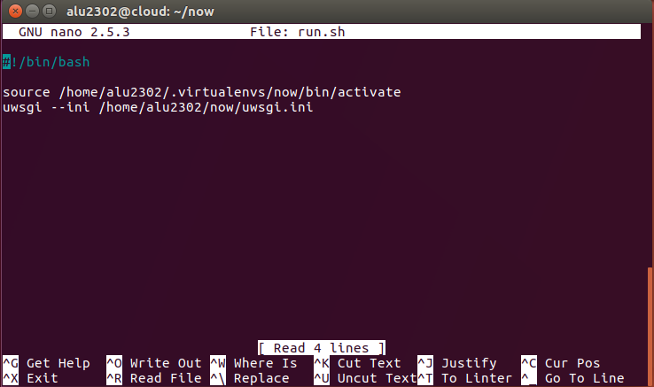
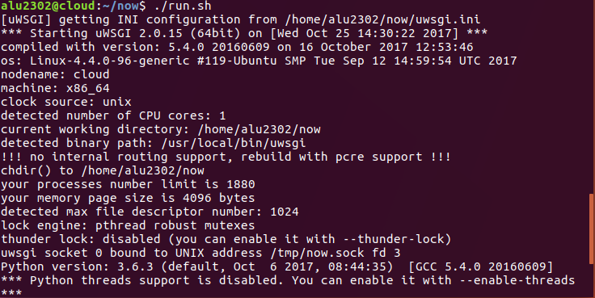
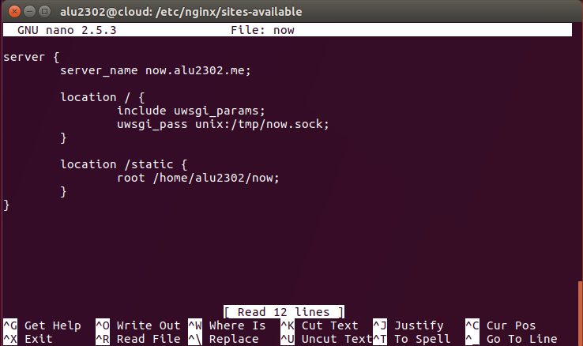
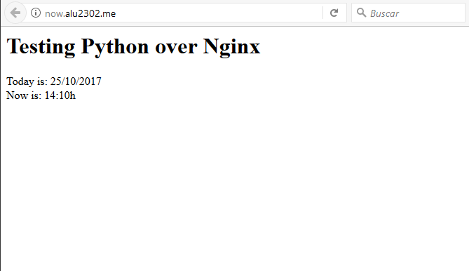

# UT1-A4: Sirviendo aplicaciones Php y Python

## Propósito de la actividad

La actividad consiste en configurar 2 sitios web (virtual hosts) en nuestro servidor web Nginx.

## Comienzo de la actividad

### Sitio web 1

Tenemos que crear un sitio web denominado `http://php.alu2302.me`, que lea el contenido PHP de un fichero descargado con anterioridad.

* Para ello, como llevamos haciendo hasta ahora, lo primero que tenemos que hacer es crear el virtualhost para la práctica, asi que nos vamos a la siguiente ruta y ejecutamos "nano":

```console

alu2302@cloud:/etc/nginx/sites-available$ sudo nano php

```

* Dentro del fichero de nuestro virtualhost especificamos la ruta en la cual se buscarán los ficheros, así como también debemos especificar que sea PHP quien se encargue de procesar la información, cosa que especificaremos en la directiva que tenemos abajo.



* Como siempre, creamos el enlace

```console

alu2302@cloud:/etc/nginx/sites-enabled$ sudo ln -s ../sites-available/php .

```

* Una vez hecho esto, nos vamos a nuestro directorio home y creamos el directorio php.

```console

alu2302@cloud:~$ mkdir php

```

* Una vez descargado y realizada la copia remota del fichero zip a descargar por medio del comando `scp`, colocamos al mismo dentro del directorio php.



* Por último, reiniciamos el servicio.

```console

alu2302@cloud:~$ sudo systemctl reload nginx.service

```

* Al acceder a la dirección http://php.alu2302.me nos debe aparecer lo siguiente:



---

## Sitio web 2

En este caso, el objetivo reside en crear un sitio web con lenguaje python desde un entorno virtual personalizado, conectando este con nuestro servidor Nginx.

* Ya tenemos instalado el paquete `virtualenv` que utilizamos para crear nuestro primer sitio web con python, por lo que creamos un nuevo entorno virtual para esta práctica.

```console

alu2302@cloud:~$ virtualenv .virtualenvs/now

```

* Y para activarlo...

```console

alu2302@cloud:~$ source .virtualenvs/now/bin/activate
(now) alu2302@cloud:~$

```

* Instalamos (dentro de nuestro entorno virtual) uwsgi, que se encargará de de procesar las peticiones http para aplicaciones con código python.

```console

(now) alu2302@cloud:~$ pip install uwsgi

```

* Y también un entorno de trabajo para desarrollo web llamado flask

```console

(now) alu2302@cloud:~$ pip install flask

```

* Una vez hecho esto, creamos el fichero python `main.py` dentro del directorio `now`, todo esto sin salir del entorno virtual.

```console

(now) alu2302@cloud:~/now$ nano main.py

```

* Este es el contenido del fichero:



* Ahora creamos el fichero de configuración de uwsgi, fuera ya de nuestro entorno virtual, pero en el directorio now.

```console

alu2302@cloud:~/now$ nano uwsgi.ini

```

* Este es el contenido de dicho fichero:



* Después creamos un pequeño script que activará el proceso uwsgi y el entorno virtual de la aplicación.

```console

alu2302@cloud:~/now$ nano run.sh

```

* Y dentro del mismo...



* El siguiente paso es darle permisos 775 al script creado.

```console

alu2302@cloud:~/now$ chmod 775 run.sh

```



* Una vez realizado todo esto, toca hacer el virtualhost, así que nos vamos a la ruta correspondiente y creamos el fichero now.

```console

alu2302@cloud:/etc/nginx/sites-available$ sudo nano now

```

* Y dentro del mismo tenemos...



* Si reiniciamos el servidor nginx y activamos el script `run.sh` (siempre apuntando al directorio `/home/alu2302/now`, que es donde se encuentra) se iniciará el proceso y funcionará la página.


