# Instalación y configuración de Wordpress
----

----
## 1. Configuración de la base de datos

* Accedemos a `mysql server` y nos logueamos como root

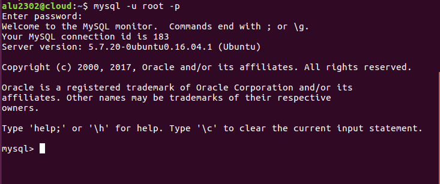

* Creamos la base de datos y añadimos los privilegios.


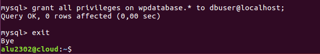


## 2. Descarga de código

* Descargamos el codigo fuente de Wordpress desde la web utilizando el comando `curl`

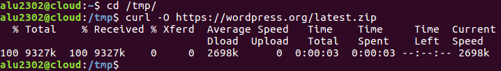


* Ahora descomprimimos el fichero zip que nos hemos descargado y lo metemos en `/usr/share`. Si no tenemos instalado la utilidad `unzip`, la instalamos.

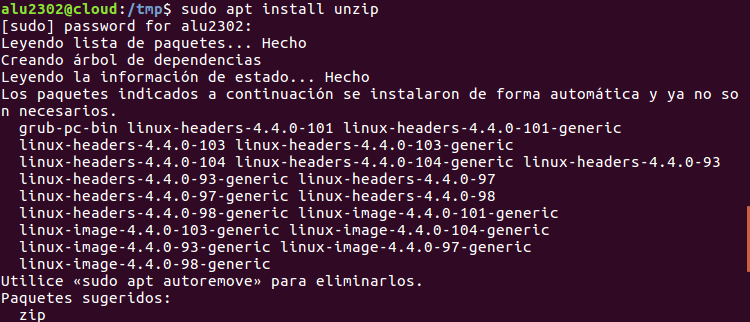

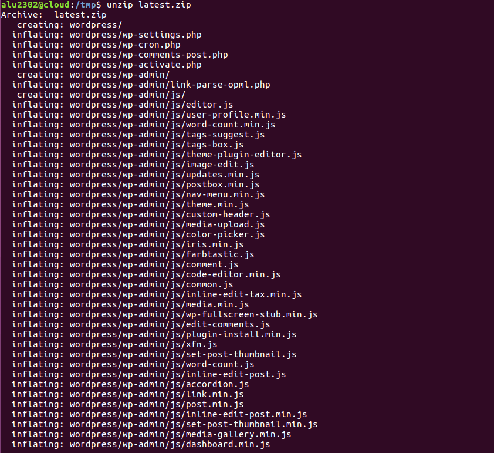


* A continuación le damos permisos al usuario `www-data` para controlar estos ficheros.


## 3. Editando los ficheros de Configuración

* Copiamos el fichero plantilla `wp-config-sample.php`, del directorio `/usr/share/wordpress/` y lo llamamos `wp-config.php` de la siguiente forma:

```console

sudo cp wp-config-sample.php wp-config.php

```

* Una vez hecho esto, tenemos que modificar una serie de líneas en ese fichero.

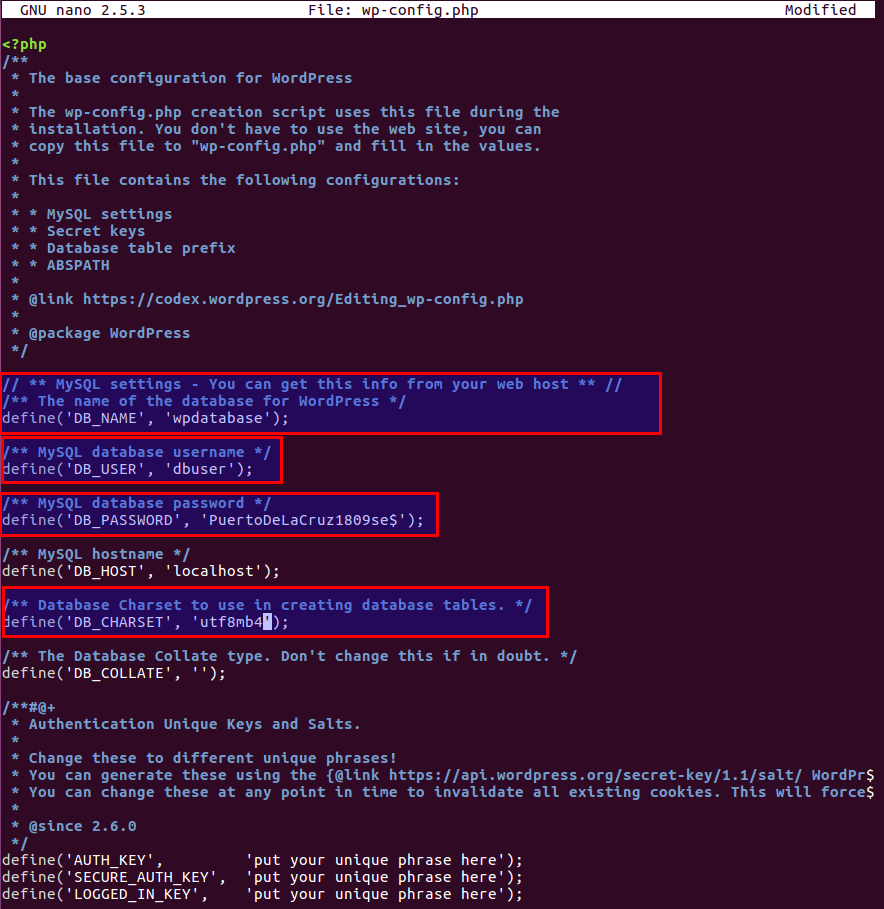

  - `define('DB_NAME', 'wpdatabase');` Identifica el nombre

  - `define('DB_USER', 'dbuser');` Identifica el usuario

  - `define('DB_PASSWORD', 'XXXXXXXXX');` Indica cual es la contraseña

  - `define('DB_CHARSET', 'utf8mb4');` Define el charset a utilizar

## 4. Acceso mediante Nginx

* Para que nuestro Wordpress sea accesible desde un navegador, tenemos que crear un virtual host en la ruta `/etc/nginx/sites-available/wordpress` con la siguiente configuración

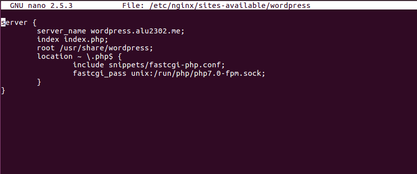

* Ahora enlazamos con el directorio `sites-enabled`


* Recargamos el servicio de Nginx


## 5. Configuración del sitio web

* Una vez hecho lo anterior correctamente deberíamos poder acceder sin problemas desde un navegador a nuestro wordpress, donde nos aparecerá una especie de asistente de instalación. En principio elegimos el idioma `Español`

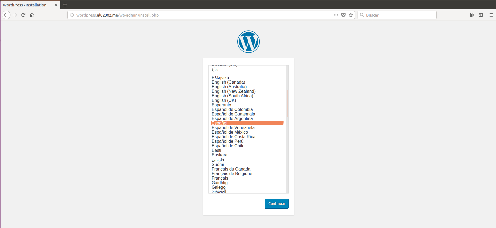

* Luego nos pedirá que rellenemos los siguientes campos


* Una vez acabado esto, ya podemos empezar

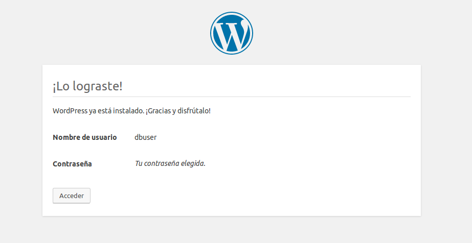


* Aquí vemos la interfaz de Wordpress por primera vez


## 6. Ajuste de permalinks y personalización de la página

* Para acceder al menu de personalización de los permalinks tenemos que acceder a ajustes (marcado con una pequeña cajetilla roja en la imagen)


* Una vez abierta dicha pestaña, de damos a la opción `Enlaces permanentes` y nos debería aparecer lo siguiente, donde en nuestro caso seleccionamos `Día y nombre`

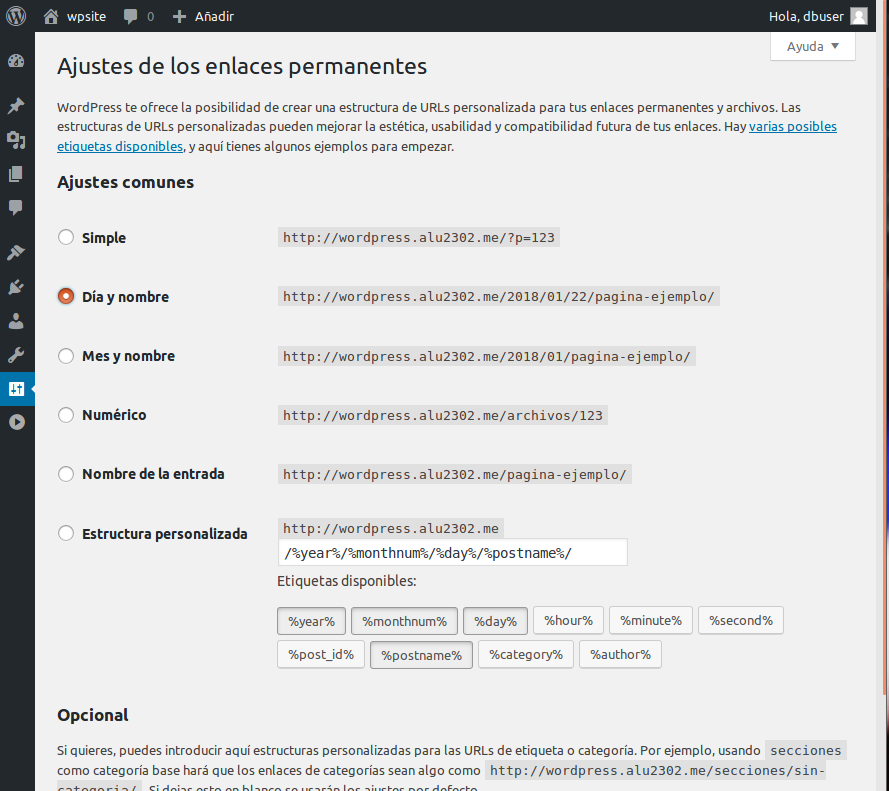

* Vamos de nuevo a la pestaña `Escritorio`, desde donde accederemos a la pestaña `Personaliza tu sitio`

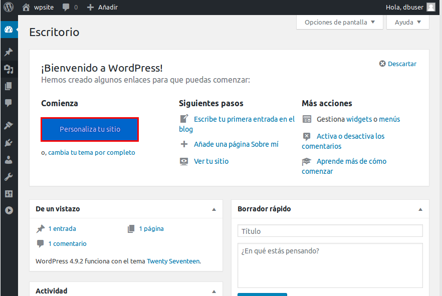

* Una vez ahí, si seleccionamos `Temas de wordpress.org` nos aparecerán muchos temas para elegir. Elegimos uno cualquiera


* Le damos a instalar

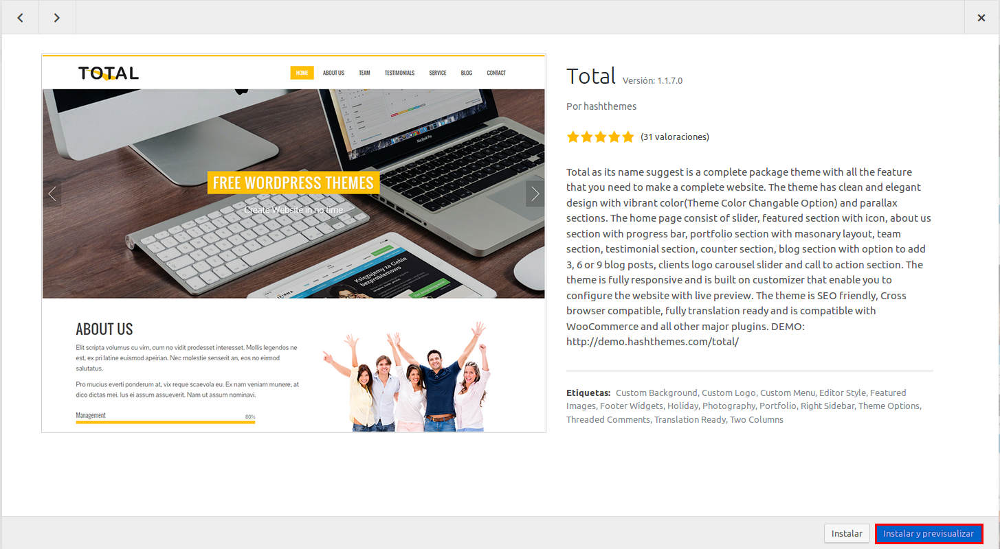

* Y aquí tenemos la vista previa de lo que sería nuestra página ahora mismo

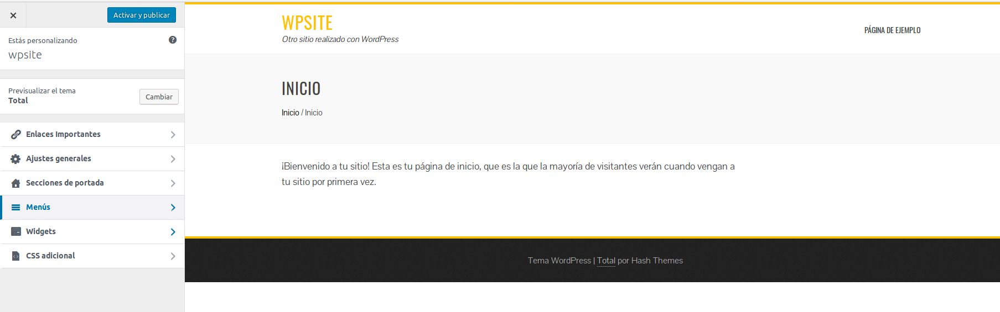

* Si vamos a `Escritorio` y luego accedemos a la pestaña `Entradas` podemos incluir noticias a nuestra web. Como prueba haremos la siguiente entrada


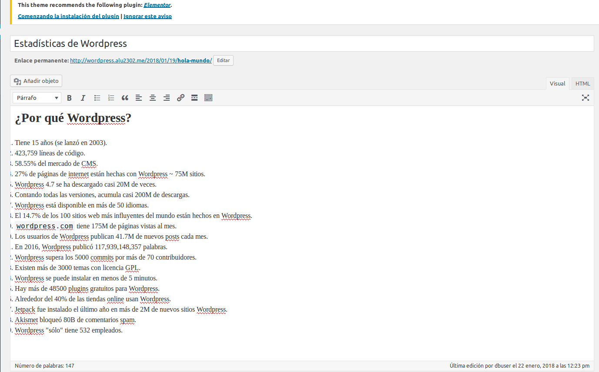

* La agregamos y aparecerá en nuestra web tal que así

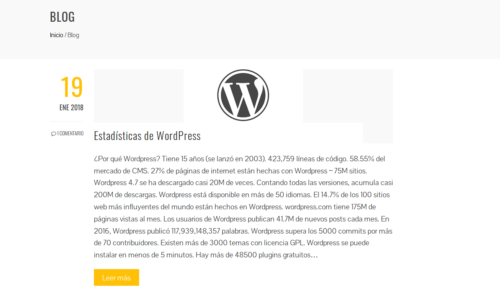


